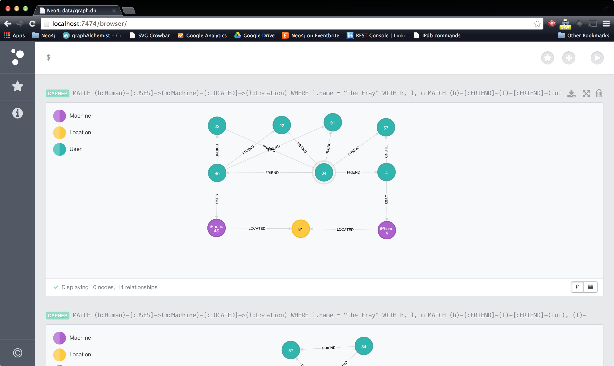

GraphofThings
=============

An Internet of Things sample data set and queries, for Neo4j, the leading graph database.

## Philosophy
"The Internet of Things," or "The Internet of Everything," at its core deals with the ability for devices to communicate with each other and to cooperate with humans.  Per Tim O'Reilly, we might even extend our understanding of IoT to the IoTH, the "Internet of Things and Humans" where the ability for things and humans to cooperate gets more nuanced when the things become smarter. 

Because the IoT is all about interactions between devices and humans, the data is very naturally a graph.  This repo houses a sample data set in Neo4j, as well as the scripts used to create the data set, and a number of sample queries.

## Quick Start
`git clone <this_repo>`    
Visit [Neo4j](http://www.neo4j.org/download) and download version >= 2.0.   
`cd <your_neo_directory>`
`./bin/neo4j start`
Neo4j is now running on port 7474.   

** Generate Database with our cypher script: **

`./bin/neo4j-shell < path/to/this/repo/data/GraphofThings.cyp`    

## Using the Generator
...
<!-- ** Generate your own data with our generator: **
...
In the `data_generators/` directory use the command `python generate_humans.py` 
and pipe the output to the neo4j shell or a file. `generate_humans.py` script 
generates 100 profiles by default but can be called with a `-n <integer>` flag
that will generate as many as you need 
(caution: this will fail for larger values of n 
since it needs to keep an array of profiles to link them)
 -->
## The Data Model
Neo4j operates off of a Property-Label Graph Model.  As concisely as possible, a graph is made up of nodes that can be categorized by one or more labels.  Node are connected by instances of directed relationships that can be queried bidirectionally.  Both relationships and nodes store properties which can be any primitive or array of primitives (string, float, integer, etc.).  You can read more about the Property-Label Graph Model [here](http://docs.neo4j.org/chunked/stable/graphdb-neo4j.html).

Our IoT graph data model consists of the following:

Node labels:
* :User - a node that indicates a persona, for example from social media, that does not exist in the scope of the IoT application currently.  Obvious examples would include Facebook user, Linkedin, Twitter, etc. 
    * Can have any number of properties relevant to the persona and use case - E.g age, email, gender.
    * Can form a relationship with any other :User or :Human node via explicit ties (e.g. for example :FRIEND, :FOLLOWS, etc.)
    * Can also carry labels that further denote the `type` of persona.  e.g. :Facebook, :Linkedin, :Meetup


* :Human - an extra label that the :User nodes which exist in context of the current Internet of Things Scope (e.g. they have devices), and are not only a persona.
    * Can have any number of properties that are relevant for the use case, e.g. age, hometown, gender, religion, email address, etc.
    * Can form relationships with :Machine, :User, and other :Human nodes.

* :Machine - a node that indicates any wearable or mobile device, that communicates with other devices or humans directly, in the Internet of Things scope.
    * Can have any number of properties relevant to the use case including type, id, and name.
    * Can form a relationship with :Human, :Location, and other :Machine nodes.

* :Location - a node that indicates an event, activity, store, park, etc. that occupies a physical space.
    * Must have a `lat` and `lon` property.
    * Can have a type property and name property indicating the event or name of the location.

* :OperatingSystem - represents the major operating systems.  For simplicity sake, Android and iOS.
    * Must contain relationships to :Machine denoting version. 
    * Can contain relationship to company that distributes operating system.


* :Company - a node that represents a device manufacturer, designer, or operating system distributor.
    * Must have relationship to :OperatingSystem and :Machine

* :Interest - an intermediary node that holds a single 'interest' category.
    * May connect to n number of :Human, :Location, :User nodes.
    * May connect to other :Interest nodes to form a hierarchy [not included]

* :LocationHier - a node in a spatial hierarchy up from a :Location node.
    * Can have a relationship to a :Location node
    * Can have a relationship to other :LocationHier nodes

Relationship types:
* :USES - a directed relationship between a human and any n number of devices they possess. 
    * (:Human)-[:USES]->(:Machine)

* :LOCATED - an action taken by a device, implying that a user visited a location. 
    * (:Machine)-[:LOCATED]->(:Location)

* :FRIEND - an implicitly bi-directional relationship implying a connection on facebook.  
    *(:Human|:User)-[:FRIEND]-(:Human|:User)

* :PING - an interaction from one device to another indicating communication.  For instance, an implicit connecting generated when two :Humans that :HAS the same :Interest are in proximity of eachother.
    * (:Machine)-[:PING]->(:Machine)

* :HAS - a relationship that indicates connection to an interest.
    * (:Location|:Human|:User)-[:HAS]->(:Interest)

* :RUNS - a relationship between a device and the operating system it runs.
    * (:Machine)-[:RUNS]->(:OperatingSystem)
    * holds the property **version**  which indicates the version of the os that is being run by that particular device.
  
* :LOCATED - a relationship between levels in a location hierarchy.
    * (:Location)-[:LOCATED]->(:LocationHier {name: "Main Street"})-[:LOCATED]->(:LocationHier {name: "Everytown"})-[:LOCATED]->(:LocationHier {name: "Oregon"}).

* :MAKES - for simplicity, a relationship indicating that a company designs, manufactuers, or distributes a device.  e.g. Nike makes Fuelband.  Apple makes iPhone.
    * (:Company)-[:MAKES]->(:MachineType)

* :DISTRIBUTES
    * (:Company)-[:DISTRIBUTES]->(:OperatingSystem)


## Example Queries
** Human based read queries:  **

All friends and friends of friends of users that attended an event:
```
MATCH (h:Human)-[:USES]->(:Machine)-[:LOCATED]->(l:Location)
WHERE l.name = "The Fray"
WITH h, l
MATCH (h)-[:FRIEND]-(f)-[:FRIEND]-(fof), (f)-[:USES]->(:Machine)-[:LOCATED]->(l)
WHERE (h)-[:FRIEND]-(fof)
RETURN DISTINCT h, f as friends, collect(fof) as friendsOfFriends
```



Friends of people that attended an event, but that did not attend the event themselves:
```
MATCH (h:Human)-[:USES]->(:Machine)-[:LOCATED]->(l:Location)
WHERE l.name = "The Fray"
WITH h, l
MATCH (h)-[:FRIEND]->(f:User)
WHERE NOT (f)-[:USES]->(:Machine)-[:LOCATED]->(l)
RETURN DISTINCT f
```

[DRAFT] Infer interests of users based on events they attend:
```
MATCH (h:Human)-[:USES]->(:Machine)-[:LOCATED]->(l:Location)
WHERE l.name = "The Fray"
WITH h, l
MATCH (l)-[:HAS]->(locationInterest:Interest)
WHERE NOT (h)-[:HAS]->(locationInterest)
RETURN DISTINCT h as target, collect(locationInterest) as InferredInterests
```

[DRAFT] Other events that event attendees may be interested in:
```
MATCH (h:Human)-[:USES]->(:Machine)-[:LOCATED]->(l:Location)
WHERE l.name = "The Fray"
WITH h, l
MATCH (l)-[:HAS]->(locInt:Interest), (otherLoc:Location)-[r:HAS]->(locInt)
RETURN l, collect(DISTINCT otherLoc)
```

** Machine based read queries:  **
[DRAFT] Device Demographics for an event:
```
MATCH (h:Human)-[:USES]->(m:Machine)-[:LOCATED]->(l:Location)
OPTIONAL MATCH (h)-[:USES]->(w)
WHERE l.name = "The Fray"
WITH (collect(w.type) + collect(m.type)) as types
RETURN reduce(phone= 0, x IN types | 
    CASE x
     WHEN 'phone' THEN phone + 1
     ELSE phone + 0
    END) as phoneCount, 
reduce(wear= 0, x IN types | 
    CASE x
     WHEN 'wearable' THEN wear + 1
     ELSE wear
    END) as wearCount,
length(types) as total
```

Individuals with a device that has runs Android 4.1 or higher:
```
MATCH (h:Human)-[:USES]->(m:Machine)-[r:RUNS]->(os:OperatingSystem)
WHERE os.name = "Android" AND r.version >= 4.1
RETURN h
```

Individuals with a device that has Android 4.1 or higher, and who have a Fitbit product.
```
MATCH (h:Human)-[:USES]->(:Machine)-[r:RUNS]->(os:OperatingSystem), (h)-[:USES]->(:Machine)<-[:MAKES]-(c:Company)
WHERE os.name = "Android" 
 AND r.version >= 4.1
 AND c.name = "Fitbit"
RETURN h, c
```

** Location based read queries:  **
```

```

** Human based write queries: **
Suggest meeting for people who attend and event and are friends of friends:
```

```

Suggest other events that people may like because their friends attended them:
```
```

** Device based write queries: **
Suggest update for any out of data Android or iOS phones that power a Fitbit Flex:
```

```

