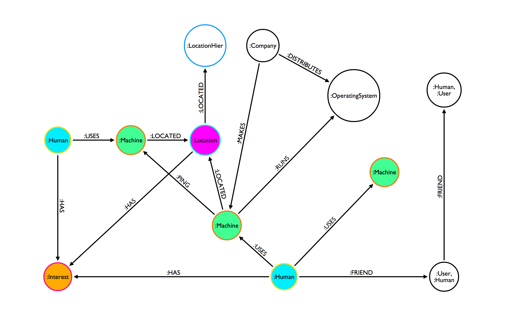

GraphofThings
=============

An Internet of Things sample data set, queries, and Neo4j database.

## Philosophy
"The Internet of Things," or "The Internet of Everything," at its core deals with the ability for devices to communicate with each other and to cooperate with humans.  Per Tim O'Reilly, we might even extend our understanding of IoT to the IoTH, the "Internet of Things and Humans" where the ability for things and humans to cooperate gets more nuanced when the things become smarter. 

Because the IoT is all about interactions between devices and humans, the data is very naturally a graph.  This repo houses a sample data set in Neo4j, as well as the scripts used to create the data set, and a number of sample queries.

## Getting Started
`git clone <this_repo>`    
Visit [Neo4j](http://www.neo4j.org/download) and download version >= 2.0.   
`cd <your_neo_directory>`
`./bin/neo4j start`
Neo4j is now running on port 7474.   

** Generate Database with our cypher script: **
`./bin/neo4j-shell < path/to/this/repo/data/artificial_humans.cyp`    

** Generate your own data with our generator: **
...

## The Data Model
Neo4j operates off of a Property-Label Graph Model.  As concisely as possible, a graph is made up of nodes that can be categorized by one or more labels.  Node are connected by instances of directed relationships that can be queried bidirectionally.  Both relationships and nodes store properties which can be any primitive or array of primitives (string, float, integer, etc.).  You can read more about the Property-Label Graph Model [here](http://docs.neo4j.org/chunked/stable/graphdb-neo4j.html).

Our IoT graph data model consists of the following:

Primary node labels:
* :Human - a node that exists in context of the current Internet of Things Scope, and is not only a persona.  
    * Can have any number of properties that are relevant for the use case, e.g. age, hometown, gender, religion, email address, etc.
    * Can form relationships with :Machine, :User, and other :Human nodes.
    * Can carry also carry :User label, to indicate association with a social media persona.

* :Machine - a node that indicates any wearable, mobile device, or stationary device that communicates with other devices or humans directly, in the Internet of Things scope.
    * Must have version property, to denote version of operating system.
    * Can have any number of properties relevant to the use case including firmware version, operating system, etc.
    * Can form a relationship with :Human, :Location, and other :Mobile nodes.
    * Can also form a TYPE relationship with :DeviceType nodes to further denote the the category of device.

* :User - a node that indicates a persona, typically from social media, that does not exist in the scope of the IoT application currently.  Obvious example would include Facebook user, Linkedin, Twitter, etc. gathered from a :Human social sign-on data.
    * Can have any number of properties relevant to the persona and use case - E.g age, email, gender.
    * Can form a relationship with any other :User or :Human node via explicit ties (e.g. :FRIEND, :FOLLOWS, etc.) or implicit ties (e.g. ? [need to flush our for current data model])
    * Can also carry labels that further denote the `type` of persona.  e.g. :Facebook, :Linkedin, :Meetup

* :Location - a node that indicates an event, activity, store, park, etc. that occupies a physical space.
    * Must have a `lat` and `lon` property.
    * Can have properties relevant to the venue.  For example, an event may have a start_time and end_time.  A store, may have an street address.
    * Can also carry labels that further classify the `type` of location.  e.g. :Event, :Retail, :Restaurant, :Home, :Activity, etc.

Secondary node labels:
* :DeviceType - a node that categorizes the :Machine that a :Human USES.
    * Must contain properties that denote the device model and year
    * Must have a makes relationship with a company

* :OperatingSystem - represents the major operating systems.  For simplicity sake, Android, iOS, and Windows.
    * Must contain relationships to :Machine denoting version
    * Can contain relationship to company that distributes operating system

* :Company - a node that represents a device manufacturer, designer, or operating system distributor.
    * Must have relationship to :OperatingSystem and :DeviceType

* :Interest - an intermediary node that holds a single 'interest' category.
    * May connect to n number of :Human, :Location, :User nodes.
    * May connect to other :Interest nodes to form a hierarchy

* :LocationHier - a node in a spatial hierarchy up from a :Location node.
    * Can have a relationship to a :Location node
    * Can have a relationship to other :LocationHier nodes

Primary relationship types:
* :USES - a directed relationship between a human and any n number of devices they possess. 
    * (:Human)-[:USES]->(:Machine)

* :LOCATED - an action taken by a device, implying that a user visited a location. 
    * (:Machine)-[:LOCATED]->(:Location)

* :FRIEND - a bi-directional relationship implying a connection on facebook.  
    *(:Human|:User)-[:FRIEND]-(:Human|:User)

* :PING - an interaction from one device to another indicating communication.  For instance, an implicit connecting generated when two :Humans that :HAS the same :Interest are in proximity of eachother.
    * (:Machine)-[:PING]->(:Machine)

* :HAS - a relationship that indicates closeness to an interest.
    * (:Location|:Human|:User)-[:HAS]->(:Interest)

* :RUNS - a relationship between a device and the operating system it runs.
    * (:Machine)-[:RUNS]->(:OperatingSystem)
    * holds the property **version**  which indicates the version of the os that is being run by that particular device.

Secondary relationship types:   
* :LOCATED - a relationship between levels in a location hierarchy.
    * (:Location)-[:LOCATED]->(:LocationHier {value: "Main Street"})-[:LOCATED]->(:LocationHier {value: "Everytown"})-[:LOCATED]->(:LocationHier {value: "Oregon"}).

* :TYPE - a relationship indicating the class of product that a :Machine is connected to.
    * (:Machine)-[:TYPE]->(:DeviceType)

* :MAKES - for simplicity, a relationship indicating that a company designs, manufactuers, or distributes a device.  e.g. Nike makes Fuelband.  Apple makes iPhone.
    * (:Company)-[:MAKES]->(:DeviceType)

* :DISTRIBUTES
    * (:Company)-[:DISTRIBUTES]->(:OperatingSystem)

## Example Data
...

## Example Queries
** Human based queries:  **

All friends and friends of friends of x user that attended y event:

...

Other events that event attendees may be interested in:

...

Friends of people that attended an event, but that did not attend the event themselves:

...

** Machine based queries:  **

TIE this to a business questions: Percentage of event attendees that have iOS, Android, and Glass components:

...

Individuals with x device that has y version:

...

Friends and Friends of Friends, which devices are most popular?

...

All people that have at least 2 friends using x or y device, but don't use it themselves?

...

